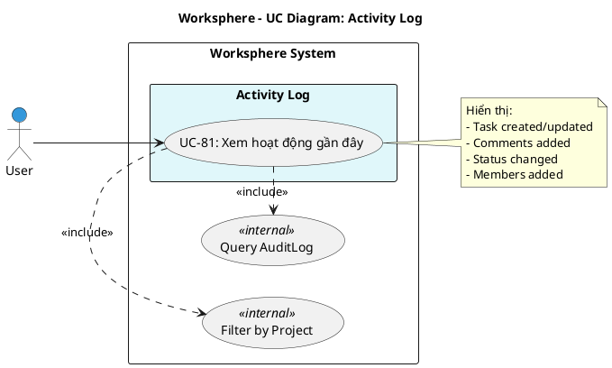

# Use Case Diagram 23: Nhật ký Hoạt động (Activity Log)

> **Module**: Activity Log | **Số UC**: 1 | **Ngày**: 2026-01-15

---

## 1. Actors

| Actor | Loại | Mô tả |
|-------|------|-------|
| **User** | Primary | Người dùng đã đăng nhập |

---

## 2. Use Case Diagram (PlantUML)

---

## 3. Bảng mô tả Use Cases

| UC ID | Tên Use Case | Actor | Mô tả |
|-------|--------------|-------|-------|
| UC-81 | Xem hoạt động gần đây | User | Xem danh sách hoạt động trong các projects là member |

---

## 4. Luồng sự kiện - UC-81: Xem hoạt động gần đây

**Tiền điều kiện:** User đã đăng nhập

**Luồng chính:**
1. User truy cập Activity page (`/activity`)
2. <<include>> Filter by Project: Lọc theo projects user là member
3. <<include>> Query AuditLog: Lấy audit log records
4. Hệ thống hiển thị timeline với các hoạt động:
   - Task created/updated/deleted
   - Status changed
   - Comments added
   - Members added/removed
   - Files uploaded
5. Có thể filter theo project hoặc date range

**Hậu điều kiện:** Activity log được hiển thị

---

## 5. Business Rules

| ID | Rule |
|----|------|
| BR-01 | User chỉ thấy hoạt động trong projects là member |
| BR-02 | Admin thấy tất cả hoạt động |
| BR-03 | AuditLog ghi lại tất cả thay đổi quan trọng |
| BR-04 | Hiển thị theo thứ tự thời gian mới nhất |

---

*Ngày tạo: 2026-01-15*
